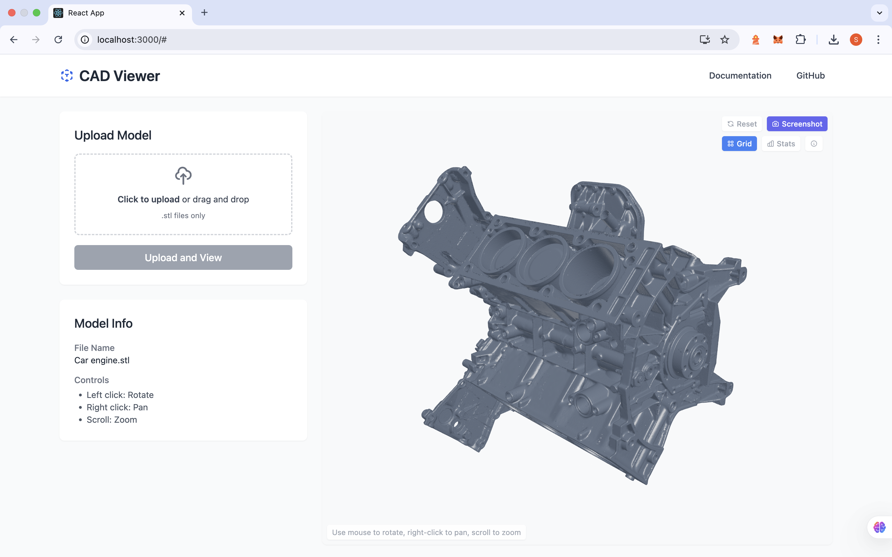

# CAD Viewer

A modern web-based STL file viewer with an intuitive user interface for viewing and interacting with 3D CAD models.



## Features

- **Easy Upload**: Drag and drop or select STL files to upload
- **Interactive 3D Viewing**: Rotate, pan, and zoom to examine models
- **Screenshot Capture**: Save the current view as a PNG image
- **Visual Controls**: Toggle grid, statistics, and more
- **Responsive Design**: Works on desktop and mobile devices
- **Modern UI**: Clean and intuitive interface

## Technology Stack

### Frontend
- React.js
- Three.js with React Three Fiber
- @react-three/drei for Three.js helpers
- Tailwind CSS for styling
- Axios for API requests

### Backend
- Python with Flask
- Flask-CORS for cross-origin support

## Getting Started

### Prerequisites

- Node.js (v14+)
- Python (v3.7+)
- npm or yarn

### Installation

1. **Clone the repository**
   ```bash
   git clone https://github.com/yourusername/cad-viewer.git
   cd cad-viewer
   ```

2. **Install frontend dependencies**
   ```bash
   cd frontend
   npm install
   # or with yarn
   yarn install
   ```

3. **Install backend dependencies**
   ```bash
   cd ../backend
   pip install -r requirements.txt
   ```

### Running the Application

1. **Start the backend server**
   ```bash
   cd backend
   python app.py
   ```
   The backend server will run on http://127.0.0.1:5000

2. **Start the frontend development server**
   ```bash
   cd frontend
   npm start
   # or with yarn
   yarn start
   ```
   The application will open in your browser at http://localhost:3000

## Usage

1. **Upload an STL file**:
   - Click on the upload area or drag and drop an STL file
   - Click "Upload and View" button

2. **Interact with the 3D model**:
   - **Left-click + drag**: Rotate the model
   - **Right-click + drag**: Pan the camera
   - **Scroll wheel**: Zoom in/out

3. **Use the controls**:
   - **Reset View**: Return to the default camera position
   - **Screenshot**: Save the current view as a PNG image
   - **Grid**: Toggle the reference grid
   - **Stats**: Toggle performance statistics
